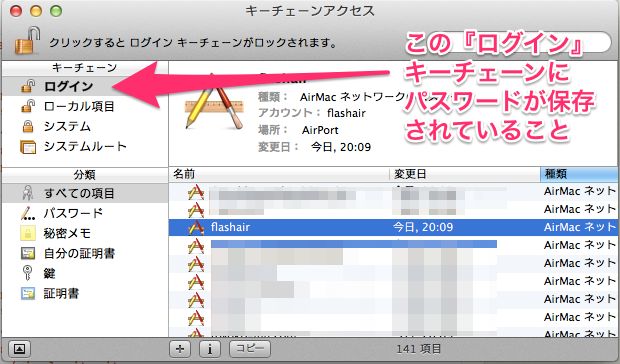

FlashAir Photos Sync
==========

概要
----------

[FlashAir](https://www.flashair-developers.com/ja/about/overview/) (東芝製の無線 LAN 機能を搭載した SDHC メモリーカード) に保存された写真データを、「ワイヤレスデータ転送」機能を使って無線 LAN 搭載の Macintosh (MacBook Air 等) にダウンロードし、さらに日付ディレクトリにアーカイブするシェルスクリプト (bash) です。

目次
----------

- [動作の概要](#動作の概要)
- [動作の詳細](#動作の詳細)
- [メリット](#メリット)
- [動作テスト環境](#動作テスト環境)
- [セットアップ](#セットアップ)
- [日常的な利用方法](#日常的な利用方法)
- [オプション](#オプション)
- [強制終了時のふるまい](#強制終了時のふるまい)
- [アーカイブ後の写真データの編集について](#アーカイブ後の写真データの編集について)
- [既知の問題点](#既知の問題点)

動作の概要
----------

[FlashAir](https://www.flashair-developers.com/ja/about/overview/) 上の写真を手元の Macintosh に一括ダウンロード (ただし既にダウンロード済のものはスキップ) し、それらを撮影日ごとに日付ディレクトリにアーカイブします。撮影日情報は [ExifTool](http://www.sno.phy.queensu.ca/~phil/exiftool/) で画像や動画ファイルの Exif ヘッダから取得します。

動作の詳細
----------

このスクリプトは以下のように動作します。

1.  事前準備 (キーチェーンからパスワードを取得)
    - ファイルサーバに接続している場合、一度接続解除を行い、後に再接続するため、そのパスワードをキーチェーンから取得
    - FlashAir の無線アクセスポイントのパスワードをキーチェーンから取得
    - 現在接続している無線アクセスポイントのパスワードをキーチェーンから取得
    - アーカイブ先をファイルサーバにしている場合はそのパスワードもキーチェーンから取得
2.  接続済みのファイルサーバの接続を解除
3.  現在接続中の無線アクセスポイントから FlashAir のアクセスポイントに切り替え
4.  FlashAir から写真データのインデックスファイルを取得し、写真データのファイル名一覧を取得
5.  FlashAir 側の写真データファイル名一覧とアーカイブ済みファイル名一覧 (初回は空) を比較し、未アーカイブのもののみダウンロード
6.  ダウンロードした写真データのヘッダから撮影日時の情報を取得し、タイムスタンプを撮影日時に更新
7.  FlashAir のアクセスポイントから元々接続してた無線アクセスポイントに切り替え
8.  元々接続していたファイルサーバに再接続
9.  ダウンロードした写真データのヘッダから撮影日の情報を取得し、階層的な日付ディレクトリに写真データを移動
10. アーカイブ先ディレクトリに階層的日付ディレクトリを同期
11. アーカイブに成功したら今回ダウンロードしたファイルの一覧をアーカイブ済みファイル名一覧に追記
12. (設定されている場合は) ユーザが指定した任意のコマンドを実行

メリット
----------

- 無線アクセスポイントの切替の自動化
    - FlashAir の「ワイヤレスデータ転送」機能はケーブル接続に比べてだいぶ便利ですが、無線アクセスポイントの切り替えも意外と一手間だったりします。特に以下の 2 点が面倒でした。これらは上記スクリプトで自動的に対処してくれます。
        1.  FlashAir 搭載デバイスを起動してから、FlashAir のアクセスポイントにいつアクセスできるのか正確にわからないので、たいていは何度かアクセス試行する必要がある
        2.  ファイルサーバにつないだ状態でうっかりアクセスポイントを切り替えるとファイル操作がハングする場合があるため、常に切替時に留意する必要がある

- FlashAir からの写真の一括ダウンロード (重複するものは省く)
    - FlashAir の提供するユーザインターフェースだと、個別的に写真データをダウンロードするには十分ですが、何十〜数百枚単位の写真を手元に一括ダウンロードするのは結構手間です。上記スクリプトは写真を一括でダウンロードしてきます (SD カード上の写真の扱いは人によりけりと思いますが、私は SD カード上のデータは一時置き場と考えてます)。ただし、過去に既にダウンロードしてアーカイブ済みのものは省きます。これは毎回の写真のダウンロードの時間短縮のためです。

- 日付ディレクトリに写真データを分ける作業の自動化
    - 写真や動画を手っ取り早くディレクトリ分けする方法の一つが撮影日による分類です。写真・動画データにはたいてい [Exif](http://ja.wikipedia.org/wiki/Exchangeable_image_file_format) の撮影日の情報も含まれています。上記スクリプトは [ExifTool](http://www.sno.phy.queensu.ca/~phil/exiftool/) を利用することでその撮影日情報を取得し、自動的に以下のような階層的な日付ディレクトリに写真をアーカイブします。

            ~/Pictures/FlashAir/
            |
            |-- 2013/
            |   |-- 20131018/
            |   `-- 20131227/
            |
            `-- 2014/
                |-- 20140101/
                `-- 20140105/

動作テスト環境
----------

- FlashAir
    - **TOSHIBA SD-WB008G**

- PC
    - ハードウェア: **MacBook Air**
    - OS: 
        - **Mac OS X 10.10.5 (Yosemite)**
        - **Mac OS X 10.9.1 (Mavericks)**
        - **Mac OS X 10.8.5 (Mountain Lion)** (〜 v1.0)
    - シェル: 
        - **GNU bash, version 3.2.51(1)-release (x86_64-apple-darwin13)**
        - **GNU bash, version 3.2.48(1)-release (x86_64-apple-darwin12)** (〜 v1.0)
    - 外部ツール
        - **[ExifTool version 9.45](http://www.sno.phy.queensu.ca/~phil/exiftool/)**

- 写真・動画データ形式
    - JPEG
    - MOV

セットアップ
----------

1. GitHub からスクリプトを入手
    - 例1:

            $ curl -L -O https://raw.github.com/mo-ya/flashair-photos-sync/master/flashair-photos-sync.sh
    - 例2:

            $ git clone git://github.com/mo-ya/flashair-photos-sync.git
2. スクリプトに実行権限を付与
    - 例: 

            $ chmod 755 flashair-photos-sync.sh
3. パスが通ったところに設置
    - 例: 

            $ mkdir ~/bin
            $ mv flashair-photos-sync.sh ~/bin/
            $ export PATH=$PATH:~/bin/
4. ExifTool をインストール
    - [ExifTool by Phil Harvey](http://www.sno.phy.queensu.ca/~phil/exiftool/) から Mac OS X Package (dmg ファイル) をダウンロード
    - dmg ファイルをダブルクリックしてインストーラを展開
    - インストーラを右クリックし、メニューの [開く] を選択すると [開発元は未確認です。開いてもよろしいですか？] と表示されるため、そこでも [開く] を選択することでインストールウィザードが起動する。あとはインストールウィザードに従ってインストールを実施
    - インストール完了後、ターミナルを開いて `exiftool` が実行可能になっていれば OK (`exiftool` は引数なしで実行すると、以下のようなマニュアル画面が表示されます)

            EXIFTOOL(1)           User Contributed Perl Documentation          EXIFTOOL(1)

            NAME
                   exiftool - Read and write meta information in files

            SYNOPSIS
                   exiftool [OPTIONS] [-TAG...] [--TAG...] FILE...
                   exiftool [OPTIONS] -TAG[+-<]=[VALUE]... FILE...
                   exiftool [OPTIONS] -tagsFromFile SRCFILE [-SRCTAG[>DSTTAG]...] FILE...
                   exiftool [ -ver | -list[w|f|r|wf|g[NUM]|d|x] ]
5. flashair-photos-sync.sh 内の以下の変数をテキストエディタで編集
    - 作業ディレクトリ
    
      このディレクトリ以下に一時写真ファイル置き場、アーカイブ済みファイルのキャッシュ、ログが設置されます。

            BASE_DIR="${HOME}/Pictures/FlashAir/working"
    - 無線デバイス名

      FlashAir に接続する無線デバイス名 (en0 や en1 など) を設定します。複数のネットワークデバイスが接続されている場合は `/sbin/ifconfig` コマンドで確認して下さい。

            NW_DEV="en0"
    - FlashAir Wi-Fi SSID 名

      FlashAir に設定している、Wi-Fi SSID 名を設定して下さい。

            FLAIR_SSID="flashair"
    - FlashAir のホスト名、アクセス先 URL、写真データファイルの一覧取得時のキーワード

      一度 FlashAir に PC で接続し、その URL を確認して以下の変数に設定して下さい。

            FLAIR_HOST="flashair"
            FLAIR_URL="http://${FLAIR_HOST}/DCIM/101OLYMP"
      また写真一覧が表示されたページの HTML ソースを確認し、各写真のファイル名を検査する場合の文字列を以下の変数に設定して下さい。(そのまま grep に渡す形で利用されます)

            PHOTO_KEYWORD="^wlansd"
    - 撮影日不明のファイルの格納先ディレクトリ
    
      ExifTool で撮影日情報を取得できないファイルの格納先ディレクトリを設定して下さい。

            UNCLASS_DIR="someday"
    - アーカイブ後に実施するコマンド (任意)
    
      スクリプトによるアーカイブ完了後に任意のコマンドを実行できます。例えば以下のように設定すると、アーカイブ完了後に iPhoto を起動しつつ、`${HOME}/Pictures/FlashAir/` 以下の 2013 や 2014 など 4 桁の数値のディレクトリ以下の写真を iPhoto ライブラリに読み込みます。この `POST_SCRIPT` は未設定でも問題ありません。

            POST_SCRIPT="open -a /Applications/iPhoto.app ${HOME}/Pictures/FlashAir/[0-9][0-9][0-9][0-9]"
    - アーカイブ先ディレクトリ (ローカル)
    
      PC 上に写真データをアーカイブする場合、下記の変数にそのアーカイブディレクトリを設定して下さい。ファイルサーバにアーカイブする場合は後述の「アーカイブ先ディレクトリ (リモート)」に値を設定し、こちらの変数には値を設定しないで下さい。なお、ローカルとリモートの両方にアーカイブを行うことも可能です。

            ARCH_LOCAL_PATH="${HOME}/Pictures/FlashAir"
    - アーカイブ先ディレクトリ (リモート)

      ファイルサーバ上に写真データをアーカイブする場合、下記の変数にそのアーカイブディレクトリを設定して下さい。

            ARCH_REMOTE_PATH="/Volumes/share/Photos/FlashAir"
      こちらを利用する場合、下記のファイルサーバに関する設定も行って下さい。

            NAS_PROT="smb"    # "smb" or "afp"
            NAS_USER="$USER"
            NAS_SERVER="192.168.1.10"
            NAS_MOUNT_PATH="share"
            NAS_LOCAL_PATH="/Volumes/share"
6. ディレクトリの作成
    - **BASE_DIR**、**ARCH_LOCAL_PATH**、**ARCH_REMOTE_PATH** に指定したディレクトリを事前に作成しておきます。
7. スクリプト実行前に一度、1) FlashAir の Wi-Fi への接続、2) (アーカイブ先がファイルサーバの場合は) ファイルサーバへの接続、を済ませておいて下さい。このスクリプトはキーチェーンからパスワードを取得する機構になっているため、事前の接続 (= キーチェーンへのパスワード登録) が必要なためです。
8. (Mavericks の場合) アプリケーションフォルダのユーティリティフォルダ内の **キーチェーンアクセス** でキーチェーンの管理ユーティリティを呼び出し、Wi-Fi パスワードとファイルサーバのパスワードが **ログイン** のキーチェーンに入っていることを確認して下さい。もしもそれ以外のキーチェーンに保存している場合、該当のパスワードを選択して Ctrl-C でコピーし、キーチェーンを **ログイン** に切り替えてから Ctrl-V でペーストして下さい。その際、ペーストする項目数だけキーチェーンアクセス認証用にパスワード入力が求められる場合があります。これは [security(1)](https://developer.apple.com/library/mac/documentation/Darwin/Reference/ManPages/man1/security.1.html) コマンドでアクセス可能なキーチェーンの制限によるもので、今後不要になる可能性があります。

   

以上で準備完了です。

日常的な利用方法
----------

以下のように -f オプションを指定してスクリプトを実行します。

    $ flashair-photos-sync.sh -f

まずキーチェーンから無線アクセスポイント切替、およびファイルサーバマウントのためのパスワードを取得します。**security** によるキーチェーンへのアクセス許可のウィンドウが出る場合があるので [許可] または [常に許可] をクリックして下さい。

    Passwords are fetched from KEYCHAIN

    ** Please Authorize "security" program to access to some passwords in KEYCHAIN **

      Fetching Wi-Fi Password for [CurWifiSSID] ... OK
      Fetching Wi-Fi Password for [flashair] ... OK
      Fetching NAS Password for [smb:user@192.168.1.10/share] ... OK

その後、接続済みファイルサーバがある場合はその接続を解除した上で、以下のメッセージが表示されます。これが表示されたら FlashAir 搭載のデジカメの電源をオンにして下さい (既に電源が入っていた場合は一度電源をオフにして再度オンにして下さい)。

    ##########################################################
    ##  Now, Switching Wi-Fi to FlashAir...                  ##
    ##                                                      ##
    ##  Please Power ON (or Reboot) FlashAir Device.        ##
    ##    (Completion of switch to FlashAir takes a time.)  ##
    ##########################################################

スクリプトが 20 回ほど 1 秒間隔で FlashAir の無線アクセスポイントへの接続のリトライを行います。手元のテスト環境だと、だいたい 5 - 10 回ほどのリトライで接続されます。

    Following message is returned.
      [Could not find network flashair.]
    Retrying (remaining 19 times) ...
    Following message is returned.
      [Could not find network flashair.]
    Retrying (remaining 18 times) ...

切替に成功すると、1) FlashAir のインデックスファイルから写真データファイルリストの入手、2) アーカイブ済みファイルのキャッシュとの比較、を行い、以下のようにダウンロード対象のファイル数と最初と最後のファイル名を表示します。問題なければ Enter を入力して下さい。

    [Donwload]
      Skip    :     1064
      Download:       60 [P1031083.JPG - PC291082.JPG]
    OK? [Y/n]:

ダウンロードが完了すると、1) 元々接続していた無線アクセスポイントへの接続切替、2) 元々接続していたファイルサーバへの接続、を行った上で、アーカイブ先ディレクトリへアーカイブを行います。アーカイブの前にアーカイブ対象ファイルが一覧されます。問題なければ Enter を入力して下さい。対象ファイルを改めてページャで確認したい場合は **2** を入力し確認して下さい。一覧を less で確認できます。

                   :
    2014/20140103/P1031131.JPG
    2014/20140103/P1031132.JPG

    sent 1392 bytes  received 410 bytes  3604.00 bytes/sec
    total size is 61817302  speedup is 34304.83

      Dry run is done. (Destination: "/Users/user/Pictures/FlashAir/")

      1 (default): Actual Sync is executed
      2          : Check Again with pager (.ex  rsync -n .. | less )
      3          : Cancel

    Please Select [1]:

なお、アーカイブをキャンセルした場合、写真データファイルは BASE_DIR 以下の写真データ一時保存ディレクトリに仮保存された状態になります (スクリプト再実行時に FlashAir からのダウンロードを省略できます)。

アーカイブ先としてローカルとリモートの両方を設定している場合は、上記メッセージが 2 度表示されることになります。

完了すると、1) アーカイブ済みファイルのキャッシュの更新 (アーカイブをキャンセルしなかった場合)、2) ログの圧縮と表示、を行い、スクリプトは正常終了します。

    Update Archived Photos List Cache File "/Users/user/Pictures/FlashAir/working/flashair-photos-sync-archived.cache" ...  done.

    [Logs]
      /Users/user/Pictures/FlashAir/working/logs/flashair-photos-sync-summary.log.20140103-105631.gz

    flashair-photos-sync is done.

オプション
----------

オプションとして、-f 以外に以下のオプションが利用可能です。

- **-d**: 写真データのダウンロード動作のみ (ダウンロードした写真データは BASE_DIR 以下の一時保存ディレクトリ上に仮保存されます)

- **-a**: アーカイブ動作のみ (-d オプション使用時や、アーカイブのみキャンセルするなどして、写真データが BASE_DIR 以下の一時保存ディレクトリ上に仮保存されている状態で使用されることを仮定しています)

- **-y**: 対話的な問い合わせがある場合に全てデフォルトで回答。ダウンロード時やアーカイブ時の問い合わせに回答するのが面倒になった際にどうぞ

- **-c**: アーカイブ済みファイルのキャッシュを削除 (FlashAir 上に多くの写真データがある場合、すべての写真をダウンロードし直しになるため注意してご利用下さい)

- **-h**: ヘルプメッセージを表示

強制終了時のふるまい
----------

FlashAir からの画像ダウンロードなど、スクリプトによる処理を途中で強制終了したい場合は **Ctrl-C** を入力して下さい。以下のようなメッセージが表示され、1) FlashAir の無線アクセスポイントに接続中である場合は元の無線アクセスポイントに再接続、2) 元々接続済みのファイルサーバがある場合はそのファイルサーバに再接続、を行った上でスクリプトを終了します。

    SIGING is received. (ex. Ctrl-C)

    Please Wait a minute, Now restoring Wi-Fi and NAS ..

    Wi-Fi Setting is being restored ... OK
      Waiting update of "/etc/resolv.conf" . done.

    Network Drives Re-Mount
      "/Volumes/share" is being mounted ...  OK

アーカイブ後の写真データの編集について
----------

このスクリプトは以下の条件に当てはまるものみ、FlashAir からダウンロード・アーカイブを行います。

- FlashAir に写真データがある
- 未アーカイブである (アーカイブ済み写真データのキャッシュから判定)

従って、既にアーカイブ済みの写真データについて何がしかの操作を加える (編集や削除等) のはスクリプトの動作に影響しません。

また、このスクリプトは写真データの削除は行わないため、FlashAir 側の古い写真を整理のために削除しても、アーカイブ済みの写真データには影響を与えません。

既知の問題点
----------

- ファイルサーバへのアーカイブのパスに空白文字が含まれている場合、マウントが成功しないはず (試してはいないですが)
    - 空白文字について特別な処理をしていないためです。今のところは未対応の予定です。
